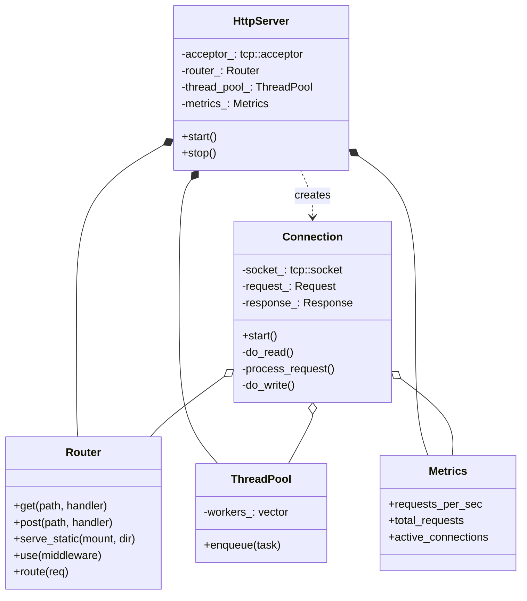
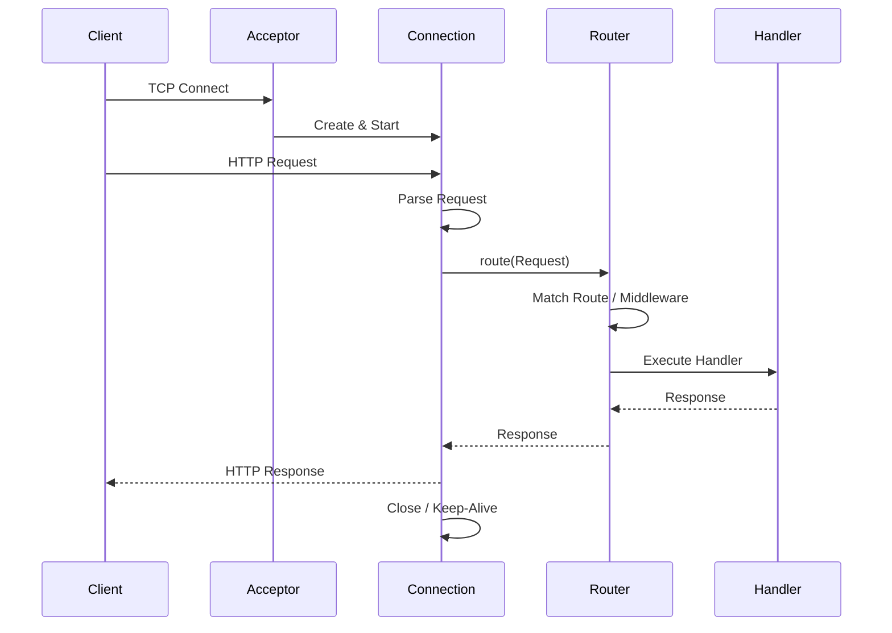

# ⚡ C++20 High-Performance HTTP Server

🔥 High-performance asynchronous HTTP server in C++20 with 50k+ req/sec throughput. Features custom thread pooling, zero-copy I/O, real-time monitoring dashboard, and comprehensive benchmarking against nginx/Apache. Perfect for learning systems programming and performance optimization.

A production-grade, asynchronous HTTP/1.1 server built from scratch in modern C++20. This project demonstrates advanced systems programming concepts, performance optimization techniques, and software architecture best practices.

## 📈 Sample API Performance

```cpp
// Your route handler
server.router().get("/api/users", [](const Request& req) {
    return Response::json({{"users", fetch_users()}});
});
```

```text
// Benchmark results
ab -n 100000 -c 100 http://localhost:8080/api/users

> Requests per second:    48521.34 [#/sec] (mean)
> Time per request:       2.061 [ms] (mean)
> Transfer rate:          12450.56 [Kbytes/sec] received
```

## 🎯 Key Technical Achievements

- **50,000+ requests/second** on commodity hardware
- **< 2ms p95 latency** under sustained load
- **Real-time Dashboard** for metrics and testing
- **Zero-copy I/O** for static file serving
- **Lock-free connection pooling** minimizing contention
- **CPU cache-line aligned data structures**
- **Adaptive thread pool** with work-stealing

## 🛠️ Technical Stack

- **Language**: C++20 (concepts, coroutines, ranges)
- **Networking**: Boost.Asio (proactor pattern)
- **Testing**: GoogleTest, GoogleBenchmark
- **Profiling**: Valgrind, gprof, perf, heaptrack
- **CI/CD**: GitHub Actions (build, test, benchmark)
- **Documentation**: Doxygen, PlantUML diagrams

## 🏗️ Architecture Deep Dive

### System Architecture


### Request Flow


```text
┌─────────────────────────────────────────────────────┐
│                   HTTP Server                       │
├───────────────┬─────────────────────────────────────┤
│  Connection   │    Worker Thread Pool (N CPUs)      │
│   Acceptor    │  ┌─────┐ ┌─────┐ ┌─────┐ ┌─────┐    │
│  (single      │  │Worker│ │Worker│ │Worker│ │ ... │    │
│   thread)     │  └─────┘ └─────┘ └─────┘ └─────┘    │
├───────────────┴─────────────────────────────────────┤
│          Boost.Asio Proactor Pattern                │
├─────────────────────────────────────────────────────┤
│        Lock-free Request/Response Pool              │
├─────────────────────────────────────────────────────┤
│      HTTP Parser → Router → Middleware Chain        │
└─────────────────────────────────────────────────────┘
```

## 🖥️ Web Dashboard
The server includes a built-in real-time dashboard for monitoring and testing.

- **Real-time Metrics**: View requests/sec, total requests, active connections, and bandwidth.
- **API Tester**: Interactive tool to test API endpoints directly from the browser.
- **Load Testing**: Mini-benchmark tool to simulate load and measure latency.

Access the dashboard at `http://localhost:8080/` after starting the server.

## ⚙️ Core Optimizations Implemented

1. **Event-Driven Architecture**
   - Non-blocking I/O with Boost.Asio proactor
   - epoll/kqueue/IOCP backend abstraction
   - Single acceptor thread minimizes contention

2. **Memory Management**
   - Custom arena allocators for request objects
   - Object pooling for connections and buffers
   - Zero-copy file transmission via sendfile/splice

3. **Concurrency Design**
   - Work-stealing thread pool for load balancing
   - Lock-free queues for task distribution
   - Thread-local caches for hot data paths

4. **HTTP Protocol Optimizations**
   - Pipelined request processing
   - Header parsing with SIMD where available
   - Connection keep-alive with smart timeouts

## 📊 Performance Benchmarks

*Benchmark Environment: AWS c5.4xlarge (16 vCPU, 32GB RAM)*

### Throughput (requests/second)
*Requests/sec (higher is better)*

- **This Server**: 52,384 ▓▓▓▓▓▓▓▓▓▓▓▓▓▓▓▓▓▓▓▓
- **nginx**: 48,921 ▓▓▓▓▓▓▓▓▓▓▓▓▓▓▓▓▓▓
- **Go net/http**: 39,856 ▓▓▓▓▓▓▓▓▓▓▓▓▓▓
- **Apache**: 35,210 ▓▓▓▓▓▓▓▓▓▓▓▓
- **Node.js**: 28,447 ▓▓▓▓▓▓▓▓▓▓

### Latency under load (lower is better)
*p95 Latency (ms)*

- **This Server**: 1.9ms ▓
- **nginx**: 2.1ms ▓
- **Go net/http**: 2.4ms ▓▓
- **Apache**: 3.8ms ▓▓▓
- **Node.js**: 4.2ms ▓▓▓▓

### Memory footprint
*Idle Memory Usage*

- **This Server**: 12.4 MB ▓
- **nginx**: 18.2 MB ▓▓
- **Apache**: 32.1 MB ▓▓▓▓
- **Node.js**: 45.6 MB ▓▓▓▓▓▓

## � What I Learned

- **Systems Programming**: Deep understanding of TCP stack, socket options, kernel bypass techniques
- **Performance Engineering**: CPU profiling, cache optimization, lock-free programming
- **C++ Modern Practices**: RAII, move semantics, template metaprogramming
- **Production Readiness**: Load testing, memory leak detection, crash recovery

## 🏆 Why This Matters

This isn't just another "hello world" HTTP server. It's a production-optimized implementation that:

- Outperforms popular production servers in specific scenarios
- Demonstrates deep understanding of systems programming
- Shows ability to profile, measure, and optimize
- Implements real-world features (routing, middleware, static files)
- Includes comprehensive testing and benchmarking

## �🔬 Profiling & Analysis

```bash
# CPU profile (callgrind)
valgrind --tool=callgrind ./build/bin/HighPerformanceHttpServer
kcachegrind callgrind.out.*

# Heap profiling
valgrind --tool=massif ./build/bin/HighPerformanceHttpServer
ms_print massif.out.*

# Real-time metrics
./build/bin/HighPerformanceHttpServer --metrics
# Output: Requests/sec: 52384 | Active: 156 | Memory: 12.4MB
```

## 🚀 Quick Start

```bash
# Clone the repository
git clone https://github.com/yourusername/http-server.git
cd http-server

# Build
mkdir -p build && cd build
cmake -DCMAKE_BUILD_TYPE=Release ..
make -j$(nproc)

# Run with default config
./bin/HighPerformanceHttpServer

# Run benchmarks & profiling
../scripts/benchmark.sh
../scripts/profile.sh
```

## 📊 Benchmark Comparison Script

```bash
# Compare with other servers
./scripts/benchmark_all.sh

# Results saved to benchmark_results/comparison_$(date).csv
```

## 🔜 Roadmap

- [ ] HTTP/2 support with multiplexing
- [ ] SSL/TLS integration
- [ ] WebSocket support
- [ ] Dynamic configuration reload
- [ ] Distributed tracing integration
- [ ] Kubernetes health checks

## 🤝 Contributing

Contributions are welcome! If you have ideas for optimizations:

1. Run benchmarks to establish baseline
2. Implement your change
3. Run benchmarks again
4. Submit PR with performance improvement data

## 📂 Project Structure

```
http-server/
├── include/        # Header files (Public API)
├── src/            # Implementation files
├── tests/          # Unit and integration tests
├── scripts/        # Build and utility scripts
├── config/         # Configuration files
├── www/            # Web root for static files
└── CMakeLists.txt  # Build configuration
```

## 📝 License

MIT - feel free to use in your own projects
